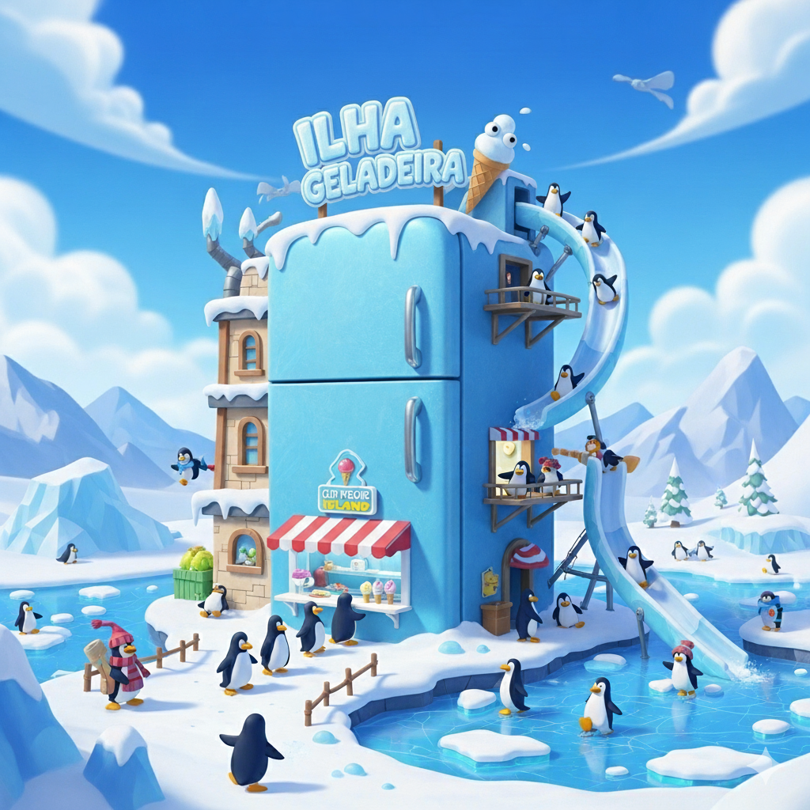

# ❄️ Ilha Geladeira

### 🎮 Tipo do Projeto

Um jogo de exploração de mundo, inspirado no clássico e falecido Club Penguin, com foco em diversão, interação e liberdade para o jogador.

### 📝 Descrição

O projeto tem como objetivo recriar a experiência nostálgica do Club Penguin, oferecendo um ambiente aberto de exploração. O jogador poderá descobrir segredos, interagir com diferentes áreas do mapa e se divertir em diversos minigames espalhados pelo mundo.

Mais do que apenas cumprir objetivos, a ideia é criar um playground digital que permita liberdade total ao jogador: ele escolhe o que fazer, quando e como, tornando cada experiência única.

### ✨ Diferencial

A liberdade de exploração é o coração do projeto. Em vez de impor metas rígidas, a Ilha Geladeira proporciona um ambiente expansível, onde a diversão surge da descoberta e interação espontânea.

### 📸 Screenshots

- [Screenshot 1](https://postimg.cc/mhd2Hd5N)  
- [Screenshot 2](https://colorado56ecia.wordpress.com/wp-content/uploads/2008/06/cpip-blog-fri2.jpg)  
- [Screenshot 3](https://cdn.prod.website-files.com/6329826d12e3aa3a6966eb1d/63efbea5b6d7ccf214cbedd1_create.png)  
- [Screenshot 4](https://www.gabtoschi.com/img/posts/club-penguin-minigame-ranking/roundup.jpg) 

### 🔨 Comando Para Compilação 

gcc src/main.c -lSDL2 -lSDL2_image -lSDL2_ttf -lm

